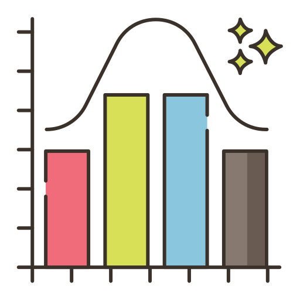

<h1 align="center">Curso de Ciencia Datos de CENTIC</h1>

<table>
  
  <!----------------------------------- 1. Pandas ----------------------------------->
  <tr>
    <th width="250" rowspan="5"><h3><a href="/01.%20Python%2C%20Numpy%20y%20Pandas">1. Numpy y Pandas</a></h3>
      </th>
    <td width="350"><a href="/01.%20Python%2C%20Numpy%20y%20Pandas/1.1%20Python.ipynb">1.1 Python</a></td>
    <td width="150"></td>
  </tr>
  <tr>
    <td><a href="/01.%20Python%2C%20Numpy%20y%20Pandas/1.2%20Numpy.ipynb">1.2 Numpy</a></td>
    <td></td>
  </tr>
  <tr>
    <td><a href="/01.%20Python%2C%20Numpy%20y%20Pandas/1.3%20Pandas.ipynb">1.3 Pandas</a></td>
    <td></td>
  </tr>
  <tr>
    <td><a href="/01.%20Python%2C%20Numpy%20y%20Pandas/1.4%20Ejercicio.ipynb">1.4 Ejercicio</a></td>
    <td></td>
  </tr>
  <tr>
    <td><a href="/01.%20Python%2C%20Numpy%20y%20Pandas/1.5%20Solucion.ipynb">1.5 Solución</a></td>
    <td></td>
  </tr>
</table>

<table>
  <!----------------------------------- 📊 2. EDA ----------------------------------->
  <tr>
    <th width="250" rowspan="4"><h3><a href="/02.%20EDA">2. Visualización</a></h3></th>
    <td width="350"><a href="/02.%20EDA/2.1%20EDA%20teoria.ipynb">2.1 EDA theory</a></td>
    <td width="150"></td>
  </tr>
  <tr>
    <td><a href="/02.%20EDA/2.2%20EDA%20teoria%20extra.ipynb">2.2 EDA theory 2</a></td>
    <td></td>
  </tr>
  <tr>
    <td><a href="/02.%20EDA/2.3%20EDA%20ejercicio.ipynb">2.3 Exercise</a></td>
    <td></td>
  </tr>
  <tr>
    <td><a href="/02.%20EDA/2.4%20EDA%20ejercicio%20solucion.ipynb">2.4 Exercise solution</a></td>
    <td></td>
  </tr>
</table>

<table>
  <!----------------------------------- 📏 3. Linear models ----------------------------------->
  <tr>
    <th width="250" rowspan="5"><h3><a href="/03.%20Linear%20models">3. Modelos Lineales</a></h3>
    </th>
    <td width="350"><a href="/03.%20Linear%20models/3.1%20Linear%20Regression.ipynb">3.1 Linear Regression</a></td>
    <td width="150"></td>
  </tr>
  <tr>
    <td><a href="/03.%20Linear%20models/3.2%20Logistic%20Regression.ipynb">3.2 Logistic Regression</a></td>
    <td></td>
  </tr>
  <tr>
    <td><a href="/03.%20Linear%20models/3.4%20Regularization.ipynb">3.3 Regularization</a></td>
    <td></td>
  </tr>
  <tr>
    <td><a href="/03.%20Linear%20models/3.5%20Polynomial%20regression.ipynb">3.4 Polynomial regression</a></td>
    <td></td>
  </tr>
</table>

<table>
  <!----------------------------------- 🌳 4. Tree models ----------------------------------->
  <tr>
    <th width="250" rowspan="5"><h3><a href="/04.%20Tree%20models">4. Modelos de Árboles</a></h3></th>
    <td width="350"><a href="04.%20Tree%20models/2.1%20EDA.ipynb">4.1 EDA</a></td>
    <td width="150"></td>
  </tr>
  <tr>
    <td><a href="/04.%20Tree%20models/2.2%20Decission%20tree.ipynb">4.2 Decission Tree</a></td>
    <td></td>
  </tr>
  <tr>
    <td><a href="/04.%20Tree%20models/2.3%20Random%20Forest.ipynb">4.3 Random Forest</a></td>
    <td></td>
  </tr> 
  <tr>
    <td><a href="/04.%20Tree%20models/2.4%20Gradient%20Boosting.ipynb">4.4 Gradient Boosting</a></td>
    <td></td>
  </tr>
  <tr>
    <td><a href="/04.%20Tree%20models/2.5%20Neural%20Network.ipynb">4.5 Optimización de Hiperparámetros</a></td>
    <td></td>
  </tr>
</table>

<table>
  <!-----------------------------------  5.Redes Neuronales ----------------------------------->
  <tr>
    <th width="250" rowspan="1"><h3><a href="/06.%20Web%20scrapping">5. Modelos Neuronales</a></th>
    </th>
    <td width="350"><a href="/06.%20Web%20scrapping/6.1%20Beautiful%20Soup.ipynb">5.1 Red Neuronal</a></td>
    <td width="150"></td>
  </tr>
</table>

<table>
  <!----------------------------------- 6. No Supervisado ----------------------------------->
  <tr>
    <th width="250" rowspan="2"><h3><a href="/05.%20Unsupervised">6. No Supervisado</a></h3></th>
    <td width="350"><a href="/05.%20Unsupervised/5.1%20Dim%20Red.ipynb">6.1 Reducción de Dimensionalidad</a></td>
    <td width="150"></td>
  </tr>
  <tr>
    <td><a href="/05.%20Unsupervised/5.2%20Clustering.ipynb">6.2 Clustering</a></td>
    <td></td>
  </tr>
</table>

<table>
  <!-----------------------------------  7. NLP ----------------------------------->
  <tr>
    <th width="250" rowspan="4"><h3><a href="/07.%20NLP">7. Procesamiento del Lenguaje</a></h3></th>
    <td width="350"><a href="/07.%20NLP/4.1%20Bag%20of%20words%20Logistic%20Regression.ipynb">7.1 BOW + Logistic Regression</a></td>
    <td width="150"></td>
  </tr>
  <tr>
    <td><a href="/07.%20NLP/4.2%20Tf-Idf%20%2B%202grams.ipynb">7.2 TF-IDF, N-Grams</a></td>
    <td></td>
  </tr>
  <tr>
    <td><a href="/07.%20NLP/4.3%20Word%20Embeddings.ipynb">7.3 Embeddings</a></td>
    <td></td>
  </tr>
  <tr>
    <td><a href="/07.%20NLP/4.4%20RNN%20with%20Keras.ipynb">7.4 RNN with Keras</a></td>
    <td></td>
  </tr>
</table>

<table>  
  <!-----------------------------------  🕐 8. Time series ----------------------------------->
  <tr>
    <th width="250" rowspan="3"><h3><a href="/08.%20Time%20Series">8. Series Temporales</a></h3></th>
    <td width="350"><a href="/08.%20Time%20Series/8.1%20TimeSeries%20with%20Prophet%20-%20Walmart.ipynb">8.1 TimeSeries with Prophet 1</a></td>
    <td width="150"></td>
  </tr>
  <tr>
    <td><a href="/08.%20Time%20Series/8.2%20TimeSeries%20with%20Prophet%20-%20Medium%20posts.ipynb">8.2 TimeSeries with Prophet 2</a></td>
    <td></td>
  </tr>
  <tr>
    <td><a href="/08.%20Time%20Series/8.3%20Ejercicio%20en%20Kaggle.ipynb">8.3 Ejercicio en Kaggle</a></td>
    <td></td>
  </tr>
</table>

<table>
  <!-----------------------------------  🖼️ 9. Image ----------------------------------->
  <tr>
    <th width="250" rowspan="2"><h3><a href="/09.%20Imágenes">9. Imágenes</a></h3></th>
    <td width="350"><a href="/09.%20Image/Classification%20-%20Fastai.ipynb">9.1 Clasification with Fast.ai</a></td>
    <td width="150"></td>
  </tr>
  <tr>
    <td><a href="/09.%20Image/Segmentation%20-%20Fastai.ipynb">9.2 Segmentation with Fast.ai</a></td>
    <td></td>
  </tr>
</table>

<table>
  <!---------------------------------  ⛏️ 10. Process Mining --------------------------------->
  <tr>
    <th width="250" rowspan="2"><h3><a href="/10.%20Process%20Mining">10.Minería de Procesos</a></h3></th>
    <td width="350"><a href="/10.%20Process%20Mining/10.1%20Process%20Mining%20con%20PM4PY.ipynb">10.1 Process Mining con PM4PY</a></td>
    <td width="150"></td>
  </tr>
  <tr>
    <td><a href="/10.%20Process%20Mining/10.2%20Process%20Mining%20con%20BupaR.R">10.2 Process Mining con BupaR</a></td>
    <td></td>
  </tr>
</table>

<table>
  <!-----------------------------------  🗄️ EXTRA ----------------------------------->
  <tr>
    <th rowspan="5"><h3>🗄️<a href="#">EXTRA</a></h3></th>
    <td>Efficient Pandas (H20 datatable, reduce memory...)</td>
  </tr>
  <tr><td>Big data (Distributed ML, Pyspark)</td></tr>
  <tr><td>GPU ML (RAPIDS, cuDF, cuML)</td></tr>
  <tr><td>ML in production (API,etc)</td></tr>
  <tr><td>Sonido (clasificacion, clasificacion temporal, separar fuentes)</td></tr>
</table>

<!--
- **Ditributed ML**: Pyspark
  - [A Neanderthal’s Guide to pyspark](https://towardsdatascience.com/a-neanderthals-guide-to-apache-spark-in-python-9ef1f156d427)
  - [collaborative filtering with Pyspark](https://www.kaggle.com/vchulski/tutorial-collaborative-filtering-with-pyspark)
- **ML on the GPU**: RAPIDS (cuDF & cuML)

-->

## Top 3 best resources:
1. [**Mlcourse.ai**](http://mlcourse.ai) (advanced)
2. [**Kaggle learn**](https://www.kaggle.com/learn) (easy)
3. [**Fast.ai ML**](http://course18.fast.ai/ml) (easy)

